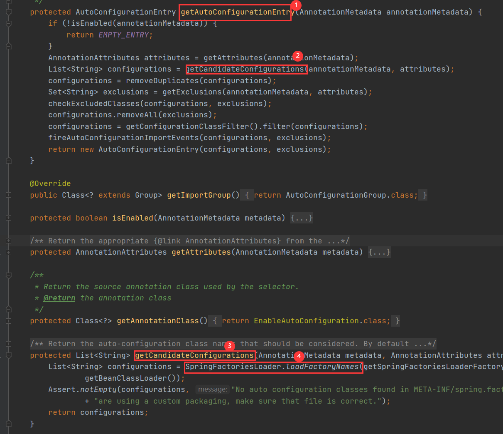

### 1、spring.factories 文件
spring.factories 文件通常以KV结构配置数据， 配置的为需要spring加载的类全路径, 以 springBoot 的核心注解 `@SpringBootApplication` 为例， `@SpringBootApplication` 注解中包含两个重要的注解 `@EnableAutoConfiguration` 和 `@ComponentScan`, 其中：  
@ComponentScan 注解的作用是扫描上下文中的组件，注册到spring容器中去， 这里上下文指的是 `@SpringBootApplication` 注解所在类的包及其子包， 扫描的是该路径下被标识的类， 例如 `@Component`、`@Service`、`@Controller`、`@Repository`、`@Configuration` 等等    
@EnableAutoConfiguration：该注解引入了 `AutoConfigurationImportSelector` 类， 该类中 `getAutoConfigurationEntry` 方法 用于加载需要注册的bean， 最终实现是通过 `SpringFactoriesLoader`实现，通过读取`META-INF/spring.factories` 文件中配置的bean类路径实例化的bean    
```java  

总结：spring.factories 用于配置需要加载的项目外的类路径，例如通过maven引入的外部包需要注册到当前spring容器，就需要提供该配置文件， 具体实现是通过 `SpringFactoriesLoader` 读取配置的类路径， 实例化bean， 并注册到spring容器中去， 


EnableAutoConfiguration